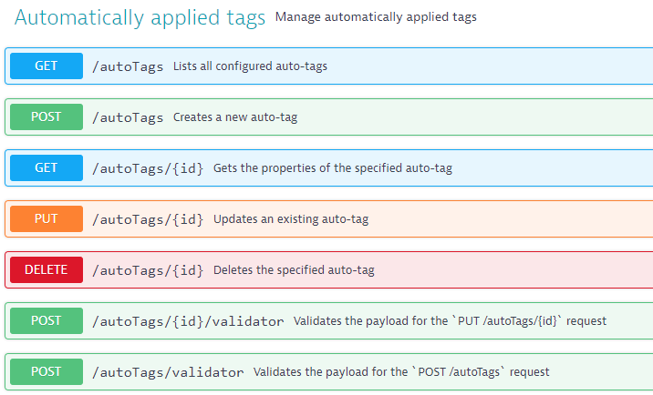
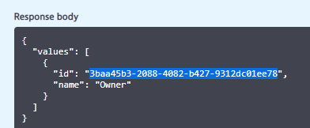

# Monaco HOT - Exercise One

Dynatrace OneAgent is already installed to the VM and is monitoring 3 applications. In this exercise we will begin by creating an automatic tagging rule inside of our Dynatrace tenant UI. We will then use the Dynatrace API to pull down the configuration of this tag to build our project files. Once our project structure is complete we will remove our automatic tagging rule within the Dynatrace UI and re-apply the rule using Monaco!

## Step One - Create Tagging Rule in Dynatrace UI

First we will create a tag that identifies the regions of specific process groups.

1. On the left hand navigation panel select `settings`
2. Navigate to Tags -> Automatically applied tags
3. Select `Create Tag`
4. Tag name = `Region`
5. Optional Tag value = `{ProcessGroup:AmazonRegion}`
6. Rule applies to `Process Groups`
7. Our condition will be `AMI ID - Exists`
8. Check the box `Apply to all services provided by the process groups`
9. Click `Create Tag Rule`
10. Click `Save Changes`


## Step Two - Review Monaco Project structure

We will review the monaco Project structure and will use your IDE or text editor to edit any necessary files in later exercises.
1. Open the `monaco-hot` folder in your IDE and navigate to **exercises** > **exercise-one**, open the `projects` folder.
2. Open and edit the `environments.yaml` file
   1. Environments are defined in the environments.yaml consisting of the environment url and the name of the environment variable to use for the API token. Multiple environments can be specified. Remove all content in `environments.yaml` and copy the block below and paste into the empty file. 
   2. ```
      three-uk:
        - name: "three-uk"
        - env-url: "YOUR_TENANT_URL_GOES_HERE"
        - env-token-name: "DT_API_TOKEN"
      ```
   3. For security reasons you should not place your environment token directly in a file.
   4. Update the env-url value to your Dynatrace Tenant address (ensure there is no trailing `/` on the end of the URL)
   5. Save the changes
3. Return to the `projects` folder. Here you'll find a folder called `three-uk` (referenced in our `environments.yaml`) that contains another folder called `auto-tag` with two files `auto-tag.json` and `auto-tag.yaml`. 
   1. Both files contain only placeholders for the repository. We'll need to update them.
   2. The `.json` file is a template used for our API payload we plan to send for tagging. 
   3. The `.yaml` file is used for the configuration we want to populate our `.json` with. The .yaml file can contain multiple configurations that can build different tag names and rules as monaco will iterate through each config and apply it to the template. In this scenario we're simply applying a single automatic tagging rule called 'Region'.

## Step Three - Build the Monaco JSON from the Dynatrace API
A great way to start building your monaco project is based off existing Dynatrace configuration. Even if you're starting with a fresh Dynatrace environment it may be worth creating a sample configuration in the UI first. This way we'll use the Dynatrace API to extract the properties of the configuration we'd like to use in monaco. From there you can use your configuration yaml file to add additional configuration.

1. Create a Dynatrace API token. Check out https://github.com/dynatrace-oss/dynatrace-monitoring-as-code#supported-configuration-types-and-token-permissions to understand which scopes you would need for the token.
2. Paste your token into a notepad for later reference.
3. Open your Dynatrace tenant. Select your profile icon and choose `Configuration API`
4. Once in the Dynatrace Config API UI, select `authorize`
    
5. Paste your token into the token field and authorize. Click close.
6. Find the Automatically Applied Tags endpoint and select it to expand.

    

Next we need to get the Tag ID of `Region` we manually created earlier.

1. click the `GET` for `/autoTags`
2. click try it out
3. click excute
4. Scoll down to the response body. Copy the id of the `Region` tag.

    

Next we'll use the `GET` for `/autoTags/{id}` endpoint

1. Select the `GET /autoTags/{id}` endpoint
2. Click try it out
3. Paste the id into the required id field
4. Set the inlude process group refrences boolean to `true`
5. Click execute
6. Scroll down to the response body

    

7. Copy the entire Response body to your clipboard.
8. Open the file `exercises/1_exercise-one/projects/three-uk/auto-tag/auto-tag.json` with a text editor.
9. Remove the placeholder and paste the copied response body from the Dynatrace API output.
10. Once the JSON is pasted into the file, remove lines **2-8**. Lines 2-8 are identifiers of the existing configuration that are not accepted when creating a new configuration in the next step. The desired file contents can also be copied from these instructions below.
    ```json
    {
      "name": "Region",
      "rules": [
        {
          "type": "PROCESS_GROUP",
          "enabled": true,
          "valueFormat": "{ProcessGroup:AmazonRegion}",
          "propagationTypes": [
            "PROCESS_GROUP_TO_SERVICE"
          ],
          "conditions": [
            {
              "key": {
                "attribute": "EC2_INSTANCE_AMI_ID",
                "type": "STATIC"
              },
              "comparisonInfo": {
                "type": "STRING",
                "operator": "EXISTS",
                "value": null,
                "negate": false,
                "caseSensitive": null
              }
            }
          ]
        }
      ]
    }
    ```

11. Save the file

## Step Four - Build the Config YAML

1. Navigate to **1_exercise-one** > **projects** > **three-uk** > **auto-tag**
2. open the **auto-tag.yaml** and edit the file
3. Remove the placeholder
4. Copy the contents below and paste into the YAML file.

    NOTE: Monaco will require the configuration YAML to always contain a `name` attribute.

    ```yaml
    config:
        - tag-region: "auto-tag.json"
      
    tag-region:
        - name: "Region"
    ```
5. Save your changes

The Config YAML tells monaco which configuration JSON to apply. You can supply addtional configuration names with seperate JSON files. Each config name has a set of properties to apply to the JSON template. In our case we're telling Monaco to use the auto-tag.json file for our tag-region configuration. Then the tag-region configuration has a value called name.

Next we will update our auto-tag.json file to be more dynamic and use environment variables to populate the tag name. This way we could structure our config Yaml to iterate through multiple tag names and configurations. 


## Step Five - Modify Auto-Tag.json

1. Open and edit the auto-tag.json file under **exercises** > **1_exercise-one** > **projects** > **three-uk** > **auto-tag**
2. On line 2 replace `Region` with the snippit below. 

    ```json
    {{ .name }}
    ```
    Our JSON template is now using the property `name` dynamically that is defined in the Config YAML. This practice provides flexibility to define multiple configs or values from other sources and populate them dynamically.

    Expected JSON file contents:
    ```json
    {
      "name": {{ .name }},
      "rules": [
        {
          "type": "PROCESS_GROUP",
          "enabled": true,
          "valueFormat": "{ProcessGroup:AmazonRegion}",
          "propagationTypes": [
            "PROCESS_GROUP_TO_SERVICE"
          ],
          "conditions": [
            {
              "key": {
                "attribute": "EC2_INSTANCE_AMI_ID",
                "type": "STATIC"
              },
              "comparisonInfo": {
                "type": "STRING",
                "operator": "EXISTS",
                "value": null,
                "negate": false,
                "caseSensitive": null
              }
            }
          ]
        }
      ],
    }
    ```

3. Save your changes

## Step Six - Execute Monaco

Now that our project files are defined for a tagging rule we'll need to manually delete our existing tag rule in the Dynatrace UI. Then we'll clone our Gitea repo to our VM and exectute monaco from our project structure to re-apply our tag.

1. Open the Dynatrace UI and navigate to `settings`
2. Open tags -> automatically applied tags and delete the tag called `Region`
3. Save changes
4. On your terminal, cd into the `monaco-hot` directory
    ```bash
    $ cd ~/monaco-hot
    ```
5. cd into the `exercises/1_exercise-one/projects` folder
    ```bash
    $ cd ./monaco/exercise-one/projects
    ```

    ***We're now ready to see Monaco in action!*** 

6. For the purposes of this training environment we'll use an environment variable to supply monaco with our Dynatrace token. For security reasons this is not recommended in live enviornments. Consider storing the token safely such as a secret or credential vault.

7.  Create a local environment variable called `DT_API_TOKEN` and input your token value we created earlier.
    ```bash
    $ export DT_API_TOKEN=[your token here]
    ```

    > Note: In Windows 10, create an environment variable using `setx <variable_name> "<variable_value>"`

8.  Execute a dry-run of Monaco (-d is the dry-run flag) which will validate our configuration is good before applying the configuration to the Dynatrace tenant. the -e flag tells monaco which environment we'd like to execute this config for. The project does not need to be specified as Monaco will automatically search the current directory for the project folder. Monaco does allow a -p flag to excplicitly specify a project directory.

    ```bash
    $ monaco -d -e ./environments.yaml
    ```
    Monaco should execute and you should not see any errors

    

9.  Remove the -d flag to execute all configurations in the project!

    ```bash
    $ monaco -e environments.yaml
    ```
10.  Check your Dynatrace environment for the `Region` tag to be recreated.

      

# ***Congratulations on completing Exercise-one!***


